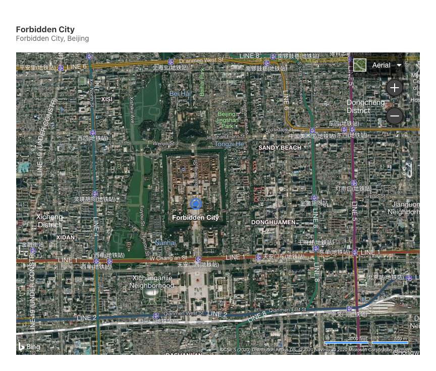
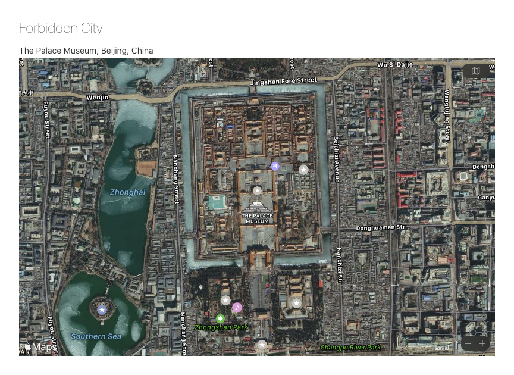
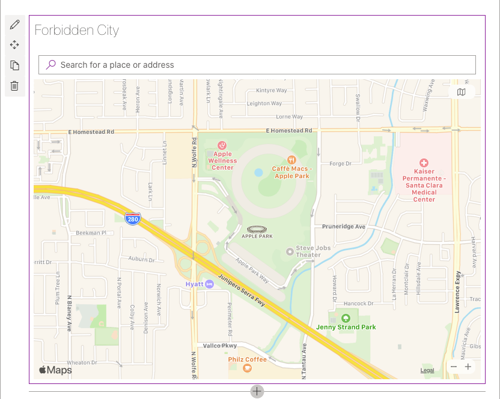
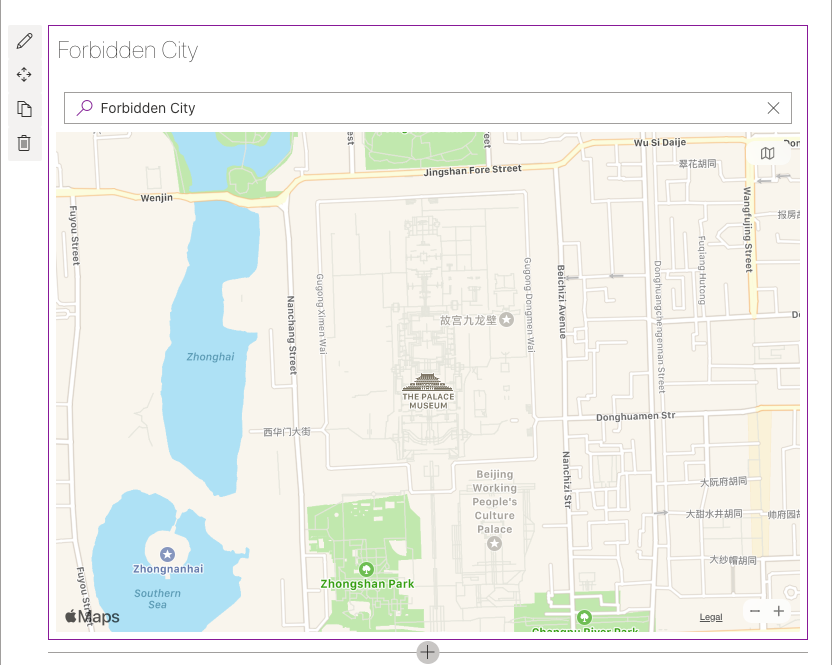
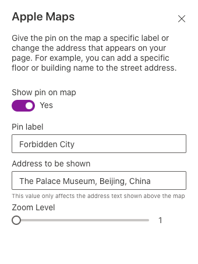
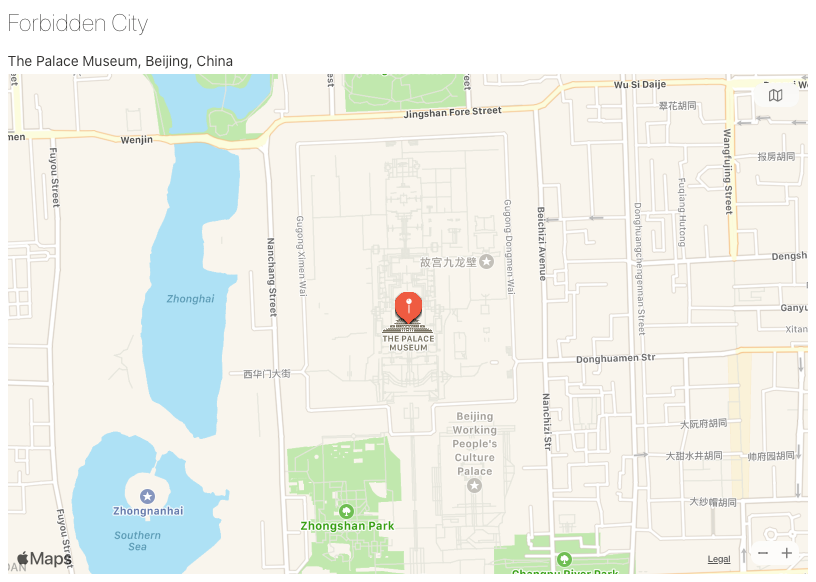

# spfx-apple-maps-web-part

Apple Maps web part for SharePoint modern page

## Summary

[Bing Maps web part](https://support.microsoft.com/en-us/office/use-the-bing-maps-web-part-c0e3f2f6-dc0d-49df-9308-1bf7c888e794) allows you to display a map on your modern page.

However, Bing Maps is limited by the [restriction](https://en.wikipedia.org/wiki/Restrictions_on_geographic_data_in_China) on geographic data in China. Bing Maps display satellite imagery using the WGS-84 coodinate system, but the street maps using the GCJ-02 datum.

When we display a location in China with Bing Maps web part. We may see the satellite imagery layer and the street maps layer is not aligned in aerial view.

Apple Maps web part is an alternative to Bing Maps web part. It displays the location with Apple Maps, which is not affected by the issue aboved.

## Used SharePoint Framework Version

## Solution

| Solution            | Author(s)   |
| ------------------- | ----------- |
| Apple Maps web part | Tse Kit Yam |

## Version history

| Version | Date | Comments |
| ------- | ---- | -------- |

## Disclaimer

**THIS CODE IS PROVIDED _AS IS_ WITHOUT WARRANTY OF ANY KIND, EITHER EXPRESS OR IMPLIED, INCLUDING ANY IMPLIED WARRANTIES OF FITNESS FOR A PARTICULAR PURPOSE, MERCHANTABILITY, OR NON-INFRINGEMENT.**

---

## How to

### Prerequisites

The web part uses MapKit JS to display Apple Maps. You need to preapre a MapKit JS token in order to use the web part. Please check [MapKit JS documentation](https://developer.apple.com/documentation/mapkitjs) for the detail.

You can use [MapKit-JS-Worker](https://github.com/tsekityam/MapKit-JS-Worker) to set up a Cloudflare Workers to provide token to the web part.

### How to build the web part

- Clone the repo

  `$ git clone https://github.com/tsekityam/spfx-apple-maps-web-part.git`

- Go to solution folder

  `$ cd spfx-apple-maps-web-part`

- install dependencies

  `$ npm install`

- Replace `http://127.0.0.1:8787/services/jwt` in [AppleMaps.tsx](src/webparts/appleMaps/components/AppleMaps.tsx) with your own token service

- Build and run the web part

  `$ gulp serve`

### How to use the web part

1. If you're not in edit mode already, click Edit at the top right of the page.

2. Hover your mouse above or below an existing web part or under the title region, click Circled plus sign used to add a modern web part to a page , and then select the **Apple Maps** web part.

3. Click **Web part title** to enter a title for your map.

   

4. Enter the address in the search box and press **Enter**

   

5. In the toolbox on the right, choose whether or not you want to display a label when user click the pin on your map. If Yes, type the text you want to appear in the Pin label box. You can also change the text for the address shown on the map in the Address to display box, and the zoom level of the map.

   

6. Save the changes

   

## References

- [MapKit JS documentation](https://developer.apple.com/documentation/mapkitjs)
- [Use the Bing Maps web part](https://support.microsoft.com/en-us/office/use-the-bing-maps-web-part-c0e3f2f6-dc0d-49df-9308-1bf7c888e794)
